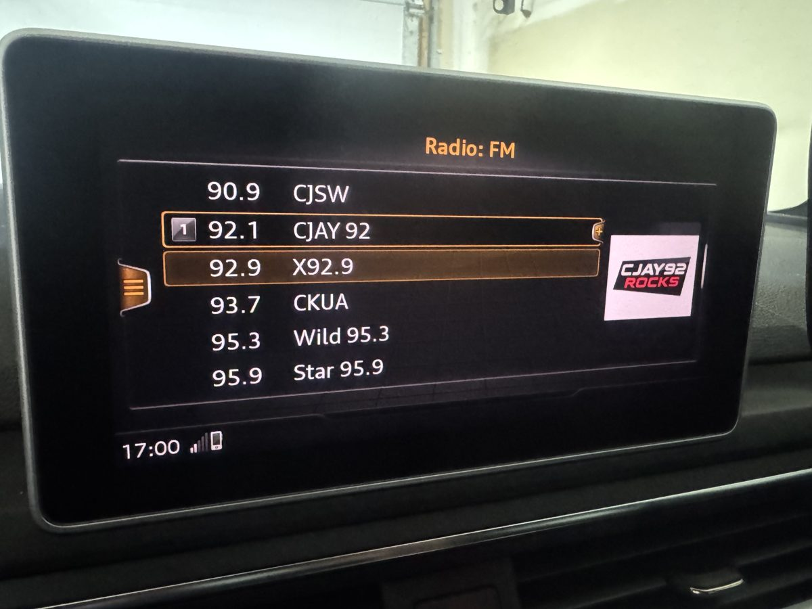

# MIB2-Canada-RadioStationDB

A Canadian RadioStationDB for MIB2 devices.

This is an attempt at a custom Canadian logo database for Harman **MIB2 High / MIB2.5 High (MHI2 / MHI2Q)** head units, so FM stations show their logo on the radio screen. It covers Calgary, Edmonton, the Greater Toronto Area and Greater Vancouver. Request your city by [opening an issue](../../issues/new/choose).

> **Status: early testing.**  I have this functional on my head unit.  This was on a 2017 Audi A4 B9 with MHI2Q_US-AUG22_P5087 firmware. I do not know if any others will function. 

*CJAY 92 in Calgary showing its logo from this database on the FM station list of a 2017 Audi A4 B9 (MHI2Q_US_AUG22_P5087).*

## City support

| City | Province | FM stations | PI codes verified in a car | Logos tested in a car |
|---|---|---|---|---|
| Calgary | AB | 25 | 23 of 25 | Yes ([example above](#mib2-canada-radiostationdb)) |
| Edmonton (incl. Leduc, Fort Saskatchewan) | AB | 23 | 20 of 23 | Not yet |
| Greater Toronto Area (incl. Hamilton, Brampton, Oshawa, Newmarket) | ON | 31 (+ CBC Radio One 99.1 shared with Calgary) | 30 of 31 | Not yet |
| Greater Vancouver (incl. Surrey, New Westminster) | BC | 19 | 0 of 19 (WTFDA logs) | Not yet |

Don't see your city? [Request it](../../issues/new/choose), or add it yourself; see [CONTRIBUTING.md](CONTRIBUTING.md).

## Download and install

Get the latest `MIB2-Canada-RSDB-vX.Y.Z.zip` from **[Releases](../../releases)**. The zip contains:

- `mod/RSDB/VW_STL_DB.sqlite`, the database.
- `INSTALL.txt`, step-by-step instructions using [M.I.B.](https://github.com/Mr-MIBonk/M.I.B._More-Incredible-Bash).
- `STATIONS.csv` and `logo-preview.png`, showing which stations and logos are in this release.

In short:

1. Back up your RSDB with M.I.B.
2. Copy `mod/RSDB/VW_STL_DB.sqlite` to the M.I.B. SD card.
3. Run **Copy RSDB to unit** and reboot.
4. Set **RSDB region = EU**. North American units ship with `none`, which switches the logo database off.

## What's in the data

Everything is in plain files under [`data/`](data), so anyone can send a pull request:

| File | Contents |
|---|---|
| [`data/stations.csv`](data/stations.csv) | One row per FM station: frequency, call sign, name, RDS PI code, logo. |
| [`data/logos.csv`](data/logos.csv) + [`data/logos/`](data/logos) | Logo images (any size; the build renders them to 160×120), with tile background and source. |
| [`data/regions.csv`](data/regions.csv) | The "Canada" region added to the database (countryId 124, RDS ECC A1). |
| [`data/region_names.csv`](data/region_names.csv) | The region's name in each of the unit's 38 menu languages. |
| [`base/VW_STL_DB.base.sqlite`](base) | The empty MIB2 base database (VW's region list, no stations, 132 KB) the Canadian data is added to. |

See [CONTRIBUTING.md](CONTRIBUTING.md) to add or fix a station.

## How it works

The unit's radio station database is a SQLite file. The build starts from the empty base (the VW table layout, region list and menu translations, with every other country's stations and logos removed) and adds:

- a "Canada" row to `CountryRegionData`,
- its menu names to `CountryRegionTranslationData`,
- one `StationLogos` row per logo (160×120 PNG),
- one `Stations` row per station, keyed by RDS PI code and frequency.

The head unit looks an FM station up by its PI code (and the region's country id), and only shows a logo when that lookup finds exactly one station, or one whose name or frequency matches. So each station must appear once: a duplicate row means no logo at all.

[docs/rsdb-structure.md](docs/rsdb-structure.md) has the full table-by-table notes.

## Credits

- [ViktorFr/MIB2-Australia-RadioStationDB](https://github.com/ViktorFr/MIB2-Australia-RadioStationDB): the proven method, and the 1.10.66 database the empty base was cut from.
- [M.I.B. – More Incredible Bash](https://github.com/Mr-MIBonk/M.I.B._More-Incredible-Bash).
- [WTFDA North American FM Station Database](https://db.wtfda.org): logged PI codes.
- Station logos come from the stations' Wikipedia pages (sources in [`data/logos.csv`](data/logos.csv)). Names and logos belong to their owners and are used only to identify the stations.

Not affiliated with Volkswagen, Audi, Harman or any broadcaster. Use at your own risk.
